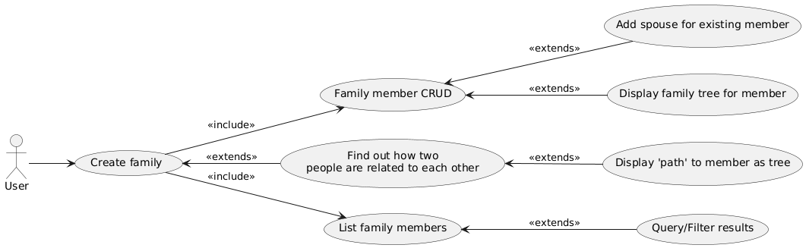

# Family tree

Project meant for storing and managing family members.


## Use case diagram


<details>
<summary>PlantUML code</summary>

```
@startuml

left to right direction

:User: as user

usecase US1 as "Create family"
usecase US2 as "Family member CRUD"
usecase US3 as "Add spouse for existing member"
usecase US4 as "Find out how two\npeople are related to each other"
usecase US5 as "Display family tree for member"
usecase US6 as "Display 'path' to member as tree"
usecase US7 as "List family members"
usecase US8 as "Query/Filter results"

user --> US1
US1 --> US2 : <<include>>
US1 --> US7 : <<include>>
US2 <-- US3 : <<extends>>
US1 <-- US4 : <<extends>>
US2 <-- US5 : <<extends>>
US4 <-- US6 : <<extends>>
US7 <-- US8 : <<extends>>

@enduml
```
</details>


# Usefull commands

## create new project
- django-admin startproject <project_name>

## create new app
- django-admin startapp <app_name>

## run development server
- py manage.py runserver

## create migration (change models first)
- py manage.py makemigrations <table>

## apply migration
- py manage.py migrate

## display executed sql on migration
- py manage.py sqlmigrate <table> <migration_number>

## interactive shell
- py manage.py shell

## checks for any problems inside a project
- py manage.py check

## more useful commands
- https://docs.djangoproject.com/en/5.1/ref/django-admin/

## pytest has been set up to run tests simply use
- pytest